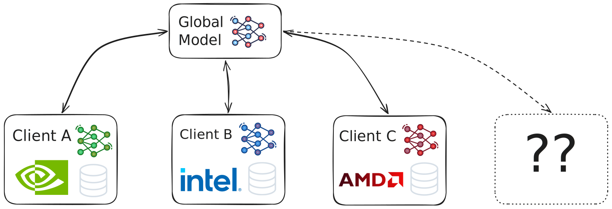

One of the clearest tendencies in LLM development has been the consolidation of high performance models in the hands of only a very few large organizations. Investment requirements have kept increasing in order to keep up with Chinchilla [@hoffmann2022trainingcomputeoptimallargelanguage] and post-Chinchilla (test-time scaling, e.g. [@snell2024scalingllmtesttimecompute]) scaling laws of model performance, while the scale-up effects of infrastructure buildout, along with leaps in low level engineering advances, have resulted in a situation quite characteristic of the early stages of any new technology innovation: large performance increases are tied with a superlinear drop in cost to achieve that performance. @fig-cost below visualizes model performance of 3 different model tiers against the cost per million tokens (on a log scale). Historically, the democratization of such high-tier cognitive capability has no precedent; access to e.g. expert-level reasoning and coding capabilities has never been available to industry and the general public at such a radically reduced price point.

![Source: Ethan Mollick, oneusefulthing.org [@cost2025]](assets/cost.jpg){#fig-cost width=90%}

The downstream effects in industry are profound. The data in @fig-metrics from [@rampAI2026] shows a drastic increase in adoption of paid subscriptions to AI-based services as the above, coupled with high retention rates and a continued exponential projected growth in the investment for AI software products. This speaks in favor of a general trend toward AI as a commodity consolidated around a handful of AI-first companies. And yet, moving into 2026 there is sufficient evidence to show other tendencies that run counter to this picture of the scale-economics of the AI adoption, which we now look at in more detail.

::: {#fig-metrics}

::: {.content-visible when-format="html"}
```{=html}
<div class="datawrapper-panel-group" style="margin: 40px 0 20px 0; width: 100%;">
  <div style="display: flex; flex-direction: column; align-items: center; gap: 0px;">
    
    <iframe src="https://datawrapper.dwcdn.net/wQR5S" style="width: 100%; max-width: 850px; border: none; display: block;" scrolling="no"></iframe>
    <iframe src="https://datawrapper.dwcdn.net/jWDre" style="width: 100%; max-width: 850px; border: none; display: block;" scrolling="no"></iframe>
    <iframe src="https://datawrapper.dwcdn.net/hOCCz" style="width: 100%; max-width: 850px; border: none; display: block;" scrolling="no"></iframe>
    
  </div>
</div>

<script type="text/javascript">
  !function(){"use strict";window.addEventListener("message",(function(a){if(void 0!==a.data["datawrapper-height"]){var e=document.querySelectorAll("iframe");for(var t in a.data["datawrapper-height"])for(var r=0;r<e.length;r++)if(e[r].contentWindow===a.source){var i=a.data["datawrapper-height"][t]+"px";e[r].style.height=i}}}))}();
</script>
```
:::

::: {.content-visible when-format="typst"}
```{=typst}
#figure(
  stack(
    dir: ltr,
    spacing: 0fr,
    image("assets/ramp1.png", width: 33%),
    image("assets/ramp2.png", width: 33%),
    image("assets/ramp3.png", width: 33%)
  ),
)
```
:::

Ramp AI Index - Monthly measurement of AI adoption by American businesses [@rampAI2026]
:::

#### Total Cost of Ownership for AI Compute

[@tco2026] shows the total cost of ownership in 2026 (caveat: for small volumes of compute, graphs based on 1 H100 host) for on-premise compute, compared to pay-as-you-go, 1, 3 and 5 year reserved cloud instances. The report shows breakeven points of 3.5, 6, 9.3, and 10.4 months, respectively (caveat: assuming 100% utilization). According to the same analysis, a utilization rate of 4.3 hours per day already make on-premise the cheaper option in imparison to pay-per-use. The authors summarize these findings as follows: *By introducing the “Token Economics” framework, we further quantify the efficiency gap, revealing that owning the infrastructure yields up to an 18x cost advantage per million tokens compared to Model-as-a-Service APIs, offering a strategic roadmap for enterprises seeking to maximize the return on their AI investments over a five-year lifecycle.* [@tco2026]. Their report considers operation such as maintenance, electricity, cooling, and firmly concludes that *as we move through 2026, the economic case for on-premises Generative AI infrastructure has solidified. The era of "cloud-first" for all AI workloads is over. While the cloud remains essential for bursty training and experimentation, the Total Cost of Ownership analysis decisively favors on-premises infrastructure for sustained inference and fine-tuning workloads* [@tco2026]. Though a strong generalization, the case can certainly be made that the economics of on-premise compute favor high utlization, predictable demand, and actors with access to dedicated infrastructure teams, among other factors.


#### Data Sovereignty & Regulatory Governance

In contrast to previous years, 2025 and 2026 have been marked by a significant increase in regulatory activity around data sovereignty and privacy. Up until this point it has been mostly possible to view the problem of data privacy in the context of frontier AI model usage essentially as a legal hurdle with largely poorly understood (and enforced) consequences. In 2026, the significant increase of regulatory governance fundamentally changes this picture. For example, In the U.S. alone, an unprecedented 741 AI-related legislative bills were introduced across 30 states by early 2026 [@esquire2026]. In Europe, the Artificial Intelligence Act (EU AI Act), the Digital Operational Resilience Act (DORA), and the by now well-established General Data Protection Regulation (GDPR), among others, have been viewed by many as a clear reason for the lack of competitiveness in Europe in terms of AI offerings and products. As a consequence, as another report finds, 62% of European organizations are actively seeking sovereign AI architectures (data & infrastructure), a trend led heavily by the banking sector (76%) and organizations in Germany (73%) and Switzerland (64%) [@sovereign2026], showing that data residency and cross-border training restrictions are no longer just high-level legal constraints, but drivers of change on a much more fundamental level. This is a regime into which collaborative decentralized learning fits in remarkably well.

#### Operative Coupling

The practical reality of leveraging foundation models in production for e.g. product development is often far away from simply using models as prediction black boxes. More specifically, there are methods, approaches and fundamental technologies that naturally tightly couple the compute to the data sources (i.e. the proprietary data and data-generating mechanisms) as well as internal infrastructure on which they are run. For example:

- Data context: Retrieval-Augmented Generation (RAGs) are strongly coupled to large vector databases that are updated frequently. Sending and storing data in this frequency may be cost-, latency-, and compliance-prohibitive. Frequent and fine-granular management of the model's operating context may be necessary to address issues such as context rot [@liu2023lostmiddlelanguagemodels] (*"as the number of tokens in the context window increases, the model’s ability to accurately recall information from that context decreases"* [@context2025]), through which models may disregard nuances in original prompt over time, leading to unexpected behaviors. This is especially relevant for agentic workflows, which are a) heavily dependent on a continuous data stream inputs to internally model their environment, and b) are required to perform consistently over time in e.g. whatever their specialist role may be.

- Execution context: Agentic workflows are strongly coupled with internal infrastructure, real-time data (model latencies factor into the quality of the output, not just how quickly that output is generated) and are heavily dependent on e.g. specialist domain expert roles and data formats. An example here is benchmarking the “Time To First Token” (TTFT): at the 50th percentile (P50), local inference achieves 15 to 30 milliseconds, whereas it is not uncommon for cloud APIs to move in the 100-300 ms range depending on the hardware, model size, use case, and the provider’s current load [@latency2026].


#### Specialists vs. Generalists

Opinions are often split when it comes to question of whether the future of AI is generalist or specialist in nature. The clear consensus, however, is that specialist models are not to be understood in the same way as we did a decade ago, synonymous with "building models for specific tasks from scratch" - the advent of foundation models has made this a wholly outdated concept. Rather, the discussion now deals with the extent to which specializing generalist models makes any (for example financial) sense at all, given the rate at which frontier AI labs in the past e.g. 5 years have been able to increase their general performance by leveraging their emerging properties, gained through training at scale. As an example, it has been shown that models trained to excel on complex mathematical reasoning also excel at code generation, scientific question-answering, and general instruction-following [@huan2025doesmathreasoningimprove]. Only about 3 years marked the difference between models that were barely competitive on high school level mathematics and models that competed at the IMO [@jeffdeanstanford2025], [@deepthink2025].

Creating specialist models from generalists ones using external cloud APIs is certainly easier in 2026 that it has been in the past, with some providers now supporting RLHF-style tuning, tool use, structured adapters, etc. However, the reality is that this offering remains highly constrained by the service provider. There is still little to no support for other relevant techniques and their many flavors (as we explore for example in this project's main use case), including the broad categories of self-supervised learning (SSL), contrastive learning (CL), reinforcement learning (RL), federated learning (FL), or more generally, support for custom losses, alignment techniques, vocabularies, tokenizers, etc. all elements that may be absolutely critical to the use case, especially when dealing with highly niche, specialized data. 

Relying on the cloud for fine-tuning workloads is not as obvious a solution as it used to be. Advances in efficient training methods such as parameter-efficient fine-tuning (PEFT) makes it wholly possible to work with high performance models on-premise, without the need to rely on entire clusters of GPUs for training. Historically, fine-tuning a multi-billion parameter model required industrial-grade GPUs, however given well-established PEFT techniques like QLoRA [@dettmers2023qloraefficientfinetuningquantized] it is possible to do this on consumer-grade graphics cards while maintaining competitive performance in many settings [@peft2026]. Methods like PEFT also play especially well with decentralized learning techniques, in that only a small subset of the model's total parameters are passed across a potentially shared network, reducing network load significantly. This is furthermore a strong facilitator for collaborative training, where the bottleneck is often not just the heterogeneity of the compute itself (see below), but the communication cost of sharing large models back and forth across a bandwidth-limited network.

The discussion on the drawbacks of fine-tuning / specializing an off-the-shelf generalist model comes from a slightly different angle, namely from concerns regarding misalignment [@Betley_2026], and catastrophic forgetting of fundamental model abilities. As the results of this project also show, this is certainly a tradeoff, one that however could be argued is fully justified for a wide variety of specialist use cases in industry. As an example, now well-established orchestration patterns for agentic workflows often rely on the concept of small, capable specialist agents, over approaches that rely on large generalist models for all subtasks: *"There’s a vastly underserved market of enterprises that want cheap, reliable models for repetitive use-cases in their systems…. Every task that a frontier agentic model does tens to hundreds of times can potentially be outsourced to a small model."* [@agents2026].


#### Open Source & Other Specialist Foundation Models

In terms of LM-based generalist models, open source offerings have traditionally tracked the performance of closed-source, proprietary models quite closely, with a gap on the scale of months rather than years in many domains. Since 2025, Chinese open source models have scored increasingly well across several model benchmarks, and though care should be taken to investigate the permissiveness of open source licenses in general, the fact remains that for several tasks, open source alternatives can now directly compete with closed source models from Western companies. At the time of writing, [@benchmarks2026] reports Kimi K2.6, MiMo-V2.5-Pro, DeepSeek V4 Pro (Max) and GLM-5.1 in places 5, 6, 11, 12 on the Artificial Analysis Intelligence Index (*"Artificial Analysis Intelligence Index v4.0 includes: GDPval-AA, 𝜏²-Bench Telecom, Terminal-Bench Hard, SciCode, AA-LCR, AA-Omniscience, IFBench, Humanity's Last Exam, GPQA Diamond, CritPt"*), trailing only a couple of points behind GPT-5.5(xhigh), Claude Opus 4.76 (max), Gemini 3.1 Pro Preview, and GPT-5.4(xhigh). The same models score competitively in places 7,4,5,6 on the Artificial Analysis Agentic Index (*"Represents the average of agentic capabilities benchmarks in the Artificial Analysis Intelligence Index (GDPval-AA, 𝜏²-Bench Telecom)"*). This example further cements the idea that at least partial independence from closed source LM-based generalists is indeed possible for several tasks.

, 6.05.2026](assets/benchmarks.png){#fig-benchmarks width=100%}


Industrial applications go further, rarely requiring only language models or LM-based automation agents. For example, in manufacturing, specialist use cases require dedicated architectures natively built for non-linguistic data. This includes zero-shot visual anomaly detection [@gu2023anomalygptdetectingindustrialanomalies] [@fučka2026anomalyvfmtransformingvision], dense 3D point cloud reconstruction for robotic spatial awareness [@zhou2023uni3dexploringunified3d] [@leroy2024groundingimagematching3d], complex multivariate time series forecasting (e.g., [@liu2026moirai20timeseries], [@ansari2025chronos2univariateuniversalforecasting]), and latent fusion models [@girdhar2023imagebindembeddingspacebind] [@zhu2024languagebindextendingvideolanguagepretraining] [@wang2025omnifuseradaptivemultimodalfusion] capable of mapping arbitrary modalities like thermal, depth, and IMU sensor data into a single joint embedding space. Robotics applications almost exclusively rely on (often proprietary) VLA (vision-language-action) models that require specialized training and optimization [@figure2026]. In materials science and drug discovery, researchers rely heavily on Graph Neural Networks (GNNs) to model complex molecular structures and protein interactions—operating on topological data that fundamentally differs from the sequential tokenization used by standard language models [@Merchantetal2023] [@deng2023chgnetpretraineduniversalneural]. Many of these offerings are available for commercial use cases or under permissive licenses such as MIT. In short, the current closed-source offering of generalist VLMs (vision-language models) often also fall short of the operational reality of many industrial use cases.


### Next-Generation Infrastructure

Localized specialization of foundation models will therefore remain necessary, even in the wake of further increases in generalist model performance. The motivation behind this project is to consider and challenge the fundamental way in which this process happens in practice, reinforcing the potential for collaborative, decentralized specialization. In this setting, different actors contribute learnings without compromising their data privacy and autonomy. In particular, one of the the aspects of this autonomy is rooted in freedom of choice for (hardware and software) infrastructure and compute. In 2026, organizations are spoiled for choice in terms of compute (whether on-premise or through cloud compute services): Trillium TPUs from Google, Trainium3 from AWS, Gaudi3 from Intel, Maia200 from Microsoft (caveat: inference-only), Cerebras processors, and of course the wide variety of AMD and NVIDIA GPUs, which have been the industry standard for AI compute for over a decade. More recently, the advent of agentic frameworks such as @openclaw2025 alongside massive leaps in the development of efficient computation methods such as pruning, quantization, distillation, etc. now make it possible to add consumer hardware into this heterogeneous patchwork of compute (most hardware in this case is focused on inference, not training, but it is an interesting trend nonetheless).

This project focuses on compute heterogeneity in industrial setups as one of the key impediments to overcome in collaborative training and fine-tuning of foundation models. Our main effort is to address this through a novel framework for decentralized learning on heterogenous compute for enterprise deployments, described conceptually in @fig-concept. The core research question can be stated as follows:

::: {.content-visible when-format="html"}
<div style="border: 1px solid black; padding: 1.5em; margin: 1em 0; font-style: italic;">

</div>
:::

::: {.content-visible when-format="typst"}
```{=typst}
#v(1.5em)
#block(
  width: 100%,
  stroke: 1pt + black,
  inset: 15pt,
)[
  _#read("_research_question.qmd")_
]
```
:::

{#fig-concept width=90%}

#### Core Problems and Requirements

The list below positions our approach to this problem and the main research question, informed by our project partners and highlighting the needs of modern enterprise deployment for collaborative model specialization. These requirements inform which and how tradeoffs were made at the system design level.

- Compute heterogeneity introduces important nuances that impact the learning method implementations and therefore software design: differences in numerical precision, parallelism models, memory constraints, training concepts, semantics, and limitations, etc. Our framework should be able to abstract over these nuances and be easily extensible to new computing architectures and paradigms.

- Our framework should support heterogeneity not just on the compute/architecture level, but on the environment level as well: users should be able to train on their laptop, using an on-premise "barebones" GPU server, through a scheduler in a computer cluster, or cloud compute directly. The framework should support heterogeneous software stacks across different programming languages.

- Focus on cross-silo decentralzation: we target fault tolerance across few (but potentially complex) compute nodes, rather than optimizing for scaling across e.g. 1000s of clients / collaborators.

- Minimization of the cybersecurity attack surface - for example, updates should not be forcibly "pushed" to clients.

- We require surgical control over the specific training configuration and procedure, forgoing vendor lock-in or high-level abstractions that make it hard to optimize for maximum efficiency at the local level.

- Our framework should be natively MLOps-integrated and thus auditable. More than just a standalone library, the framework itself represents a complete workflow that is deeply integrated with a modern, best-in-class MLOps toolchain.

- Our framework should be as close to "plug-and-play" as possible with new environments, compute architectures. It should function as a thin wrapper with minimal dependencies, making it possible to run in restrictive environments like HPC clusters in corporate environments.