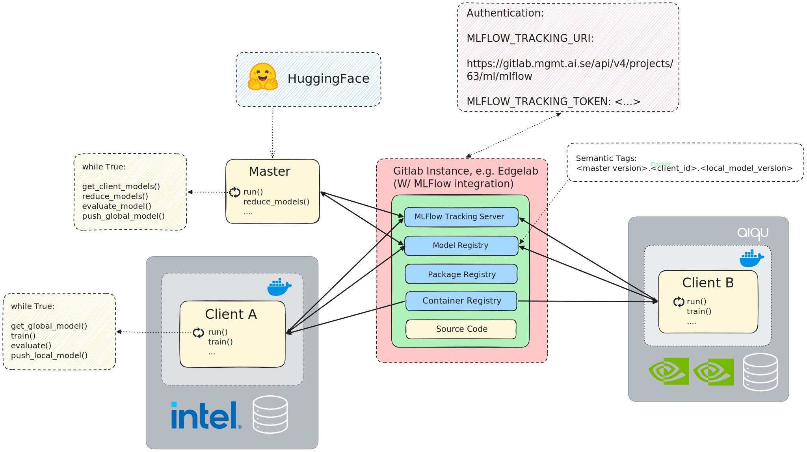

### Architecture and Basic Concepts

{#fig-nextgen width=100%}

The choice of architecture presented in @fig-nextgen is heavily informed by the requirements introduced in the introductory section of this report. These requirements strongly point in the direction of security, transparency, and modularity (e.g. for redundancy) suitable for enterprise deployments. A successful architecture must effectively address two main concepts: 1) the node deployment pattern (i.e. the lifecycle management of client and server nodes, where they run and how), and 2) the communication pattern (how these deployed nodes communicate with each other). We outline the conceptual design of these patterns below, followed by their practical software implementation.

#### Conceptual Implementation

For our architecture, the communication pattern requirements translate to two core design decisions: 1) clients must only ever participate *willingly* in the federation process, i.e. models and updates may not be forcibly pushed, and 2) central-orchestrator patterns, where clients work as "dumb" workers at the behest of a central, opaque orchestrator, are not suitable. Instead, we rely on the concept of "blackboard pattern", where the state is central, observable, and consumed not just by the compute-heavy clients, but the (traditionally central) FL server as well. All nodes of the federated learning framework are therefore equal-class citizens, but perform fundamentally different functions independently of each other. The following describes an interaction scenario between these nodes during a typical training run, as implemented by our framework:

1. A user creates a master node using a specific experiment configuration. The node automatically sets up i.e. downloads the model, tags it, and uploads it to the "blackboard". The node knows in advance how many clients to expect in the federation process, so it continually monitors the versions numbers visible there, and idles until all clients have contributed their local models for the current round.

2. A user creates one or more client nodes. By using the same experiment identifier as the previously created master node, the client monitors the available model versions for the running experiment, and downloads the latest available global model version.

3. The client node sets up its local dataloaders, model training stack, etc. and runs the local training according to the hyperparameters of the given experiment configuration. After training is done, the client bumps the model version and pushes it back to the blackboard, and idles until a new global version is made available.

4. Meanwhile, the master node periodically queries which (client) model versions exist for any global model version, and downloads and aggregates all client models as soon as they are available. It then bumps the model version and uploads it, repeating the cycle for as many global iterations as the user specified in the experiment configuration.

Note that this concept is designed with operational robustness in mind: if a client or master node fails at any point, the remaining nodes are unaffected, as their behavior only depends on the blackboard itself. Furthermore, when nodes are started, they always look for the latest model version(s) available, i.e. do not assume training re-starts from scratch every time. This means that users can simply re-run node deployment calls as-is, and the resulting nodes simply pick up where they left off.

Perhaps most importantly, the conceptual design of the framework allows it to remain applicable to multiple use cases and use case types. While the framework handles the FL orchestration logic as described above, it does not assume any particular type of underlying model, training method, or software stack; the data by definition is always constrained to the clients anyway. Users of this library can use it to train traditional vision models in a supervised setting just as easily as e.g. language models in a self-supervised setting, like we have done in this project. See below for additional practical considerations.

In terms of the node deployment pattern, containerization is the key concept that enables the heterogeneous patchwork of compute in this architecture. This allows the different clients (as well as the master node) to work in *an optimized way (i.e. for their respective compute architecture)*, in isolated environments that implement the communication pattern detailed above. A basic containerization tactic allows clients to abstract the complexity of their inner workings away, translating internal system complexities (e.g. dependencies on specific libraries or hardware architecture optimizations) to a single external dependency, namely the API that we introduce in this framework: the API that coordinates the learning mechanics between different nodes of the architecture.

#### Actual Implementation

The following subsections illustrate how the conceptual implementation for the learning framework was mapped to specific tools and software components. We note that the main contribution of this framework is actually *not* the specific implementations below - by design users are not vendor-locked to any of these options, and many stand-in replacements exist that allow for other implementations of the same conceptual architecture. The configuration below simply validates the concept of our framework, showing that there is at least one such implementation that works in practice.

##### The Gitlab Blackboard and Communication Protocol

In a sense, Gitlab is an excellent starting point for this framework, since it is open source (more specifically: open-core), and contains all of the necessary components that we need for a complete blackboard approach. We note, however, that these components could all be decentralized and sourced from different providers, without changing the fundamental way in which this framework works. These components include:

- **Model registry**: with its [native MLFlow integration](https://docs.gitlab.com/user/project/ml/experiment_tracking/mlflow_client/), Gitlab provides repositories with space to store and associate model weights with experiments (additionally for FL: a place to store intermediate client versions / specializations)
- **MLFlow tracking server**: learning metrics for experiments can also be tracked directly in Gitlab. Model weights and the monitored metrics are tightly coupled from an architectural point of view, providing higher visibility that highlights the provenance of any given model.
- **Package registry**: a space to store different model releases of the training code itself.
- **Container registry**: a space to store Docker images, each tailored for e.g. different compute environments. Clients run their training in their respective containers spawned from these images; the entire containerization stack (the code, the Dockerfile specification, all runtime optimizations, etc.) all remain visible and auditable as part of the joint learning project.

The NextGen Framework builds on top of this joint offering. Every model training project gets its own such "blackboard" (i.e. a Gitlab project / repository with fresh instances of all of the components above), and leverages the NextGen Framework in order to manage the FL training cycle. Under the hood, the framework uses the Gitlab REST API to allow the master node (where client models are e.g. aggregated and tested) and client compute nodes (where the training on client-local data actually happens) to pull and push models to the central model repository *and not directly to and from each other*. This design allows the master node to be completely decoupled from the client nodes, i.e. no direct communication ever occurs between these. Intermediate models are transparently stored in the Model Registry (in the Gitlab UI under `Deploy -> Model Registry`).

##### Authorization

Authorization is controlled via the environment variables `MLFLOW_TRACKING_URL` and `MLFLOW_TRACKING_TOKEN`, which are set on a per-project basis, and shared among all collaborators in the project. These variables control read and write access to the model registry and tracking server. More details on this below.

##### Model Versioning

The Gitlab model registry relies on semantic model versioning, which we adapt to track federated model versions across sets of clients. We manually build model version numbers using the following semantics:

    {global model version}.{client_id}.{local model version}

For example, a version tag of `1.2.3` corresponds to a model that has gone through global aggregation once (1), is currently being trained further at client with ID 2, and at that client, has a local version number of 3 (for example, after training 3 epochs locally). Some tags have special meanings. For example, a version tag of `2.0.0` corresponds to the model at the master node after 2 aggregation rounds from clients. Likewise, a version tag of `0.0.0` represents a fresh model for which training has yet to begin.

##### Docker

Docker becomes an essential tool to create and optimize the environment for local compute units. The blackboard pattern dictates *what* the model weights look like, but containerization options like Docker dictate *how* they are computed. For example, to leverage the full potential of a Gaudi HPU, users could launch training runs in a Docker container that builds on top of the optimized libraries offered by HabanaLabs (i.e. using `optimum-habana`), rather than generic ones. A different user could pull in that exact same code in a container optimized for AMD or NVIDIA CUDA. Note that this is outside the scope of this framework and up to the client project: the only requirement from a framework perspective is connectivity to Gitlab / the "blackboard" from wherever the training loop is run. As part of its offering, Gitlab provides a container registry, which we use to transparently house Docker images that can be used as templates for different compute environments.

##### Intra-Node Scaling

Our framework completely abstracts away the concept of what a 'compute node' is in its setup. What this means in practice: in the descriptions and generalizations above, a "client node" in the framework isn't just a laptop or local GPU, it can be an entire multi-GPU or multi-HPU cluster, or anything in between. For example, a single client can be composed of multiple compute units (GPUs, HPUs, etc.) that use the Pytorch DDP API. Since this client still outputs a single set of weights it is therefore still interpreted by our framework as a single client. This is a particularly important point and distinction for enterprise setups, where nodes are often multi-accelerator units that cannot be logically addressed at the per-accelerator level. Even more concretely, certain types of learning may require horizontal scaling in this way. For example, in this project we rely heavily on contrastive learning methods, which benefit from having large batch sizes in the training loop. For contrastive learning, training in DDP with the `gather_across_devices=True` setting accumulates a virtual batch size (adds more negatives) in a way that is simply not achievable when breaking away from the DDP setup in favor of smaller compute clients, or when setting `gradient_accumulation_steps` > 1. See the use-case section below for more details on contrastive learning as applied to our use case.

##### Generalizability

As stated above, one important feature of this framework is its applicability across use cases, with some use cases putting more stress on the current architecture than others. Because the current framework implementation relies on the blackboard pattern, the Gitlab Model Registry, and Dockerized environments, the orchestration layer is completely decoupled from the mathematical payload. The Gitlab registry does not care what is inside the model version artifact, only about its version tag. This means:

- A client could upload a 40GB full-weight checkpoint.
- A client could upload a 50MB LoRA adapter.
- A client could even upload a purely quantized artifact.

From a framework-theoretical perspective, these are all equivalent - it is solely up to the user (outside of the scope of this framework) to know how to parse, aggregate, and train these artifacts in their own code. However, not all options have the same effect: training full sized models like in the first option is bound to reach the LFS limits of Gitlab sooner than training small LoRA adapters, in particular because the current implementation transparently saves all intermediate models across all federation rounds. The network itself can also quickly become a bottleneck here. See below for more general limitations of the current approach.

##### Deployment

Our deployment strategies rely heavily on a containerization tool like Docker. Motivated by the requirement of being able run not just across different compute hardware manufacturers, but likewise across heterogeneous compute *environments*, we differentiate between the two setups below. Note that regardless of which applies, both setups *only* require visibility and access to the Gitlab instance, which may require manual whitelisting of IP addresses and ports, depending on the situation.

- **Direct access to compute resources**. These are situations where compute resources are transparent to a user, i.e. users can launch training runs directly via a remote session, or even directly on their own local machine. This use case also encompasses using cloud compute resources. In this case, users can simply launch the node deployment scripts provided by this framework as-is; however, we strongly recommend relying on a controlled execution environment like a Docker container, see below. A good pattern here is to set up the underlying Docker image as a purely "environment" / development image, which mounts rather than copies any data or code, thus making it highly reusable (coupled to infrastructure, not code).

- **Indirect access via a scheduler**. Support for this use case is a must, since access to enterprise compute resources is almost always managed by a scheduler. In this project, we use Aixia's [AiQU](https://aixia.se/en/our-offer/ai-solutions-2/aiqu/) scheduler as an example, to show how to connect these resources using our learning framework. AiQU expects a Docker image as an input, and spins up a container in order to run it with a specific, user-given command. Our framework automates this process as follows (this is after performing the one-time setup of e.g. correctly defining and assigning resources such as GPUs and storage to queues, configuring firewalls and networking, access rights, etc.):

    1. Clients define a CI/CD workflow to build the Docker image that packages the latest revision of their code.
    2. This project (NextGen framework) provides Gitlab CI templates in `/templates` that users of this framework can use. These templates expose the AiQU call parameters - some of these can be automatically populated, such as the pointer to the latest image build.
    3. This project makes a manual job available that the user can start using the Gitlab UI. This job wraps all of the populated parameters in a JSON format and packs this in a REST call to the AiQU API, which then uses this input to spawn a new job.

    Notably, when dealing with schedulers, there are at least two possible different implementation concepts: 1) starting a long-running job, which idles when no further computation is possible (e.g. one client is waiting on the others to finish in the current round), or 2) jobs are transient, with new jobs starting and stopping as soon as possible. New jobs pick up on the latest training state (the model versions published in the Gitlab model registry) and simply continue as necessary. Both variants are viable, and while the latter option is preferable in order to maximize the utilization of compute resources in e.g. a large cluster, we opt for the former version for the sake of simplicity in this initial demonstrator.

