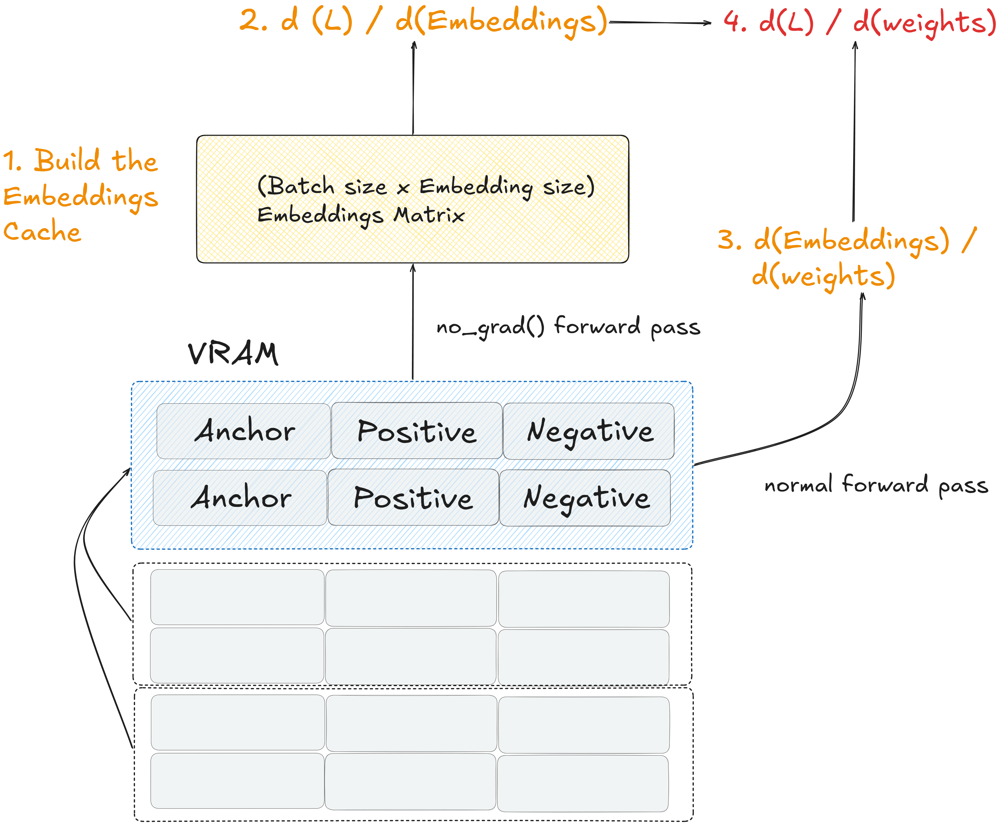

### Understanding Batch Sizes in Cached Contrastive Learning (GradCache)

When training Sentence Transformer models using a cached loss function (e.g., `CachedGISTEmbedLoss` or `CachedMultipleNegativesRankingLoss`), the traditional rules of deep learning memory management no longer apply.

These loss functions use an algorithm called **GradCache**, which decouples the mathematical "hardness" of the contrastive task from the physical VRAM limits of the hardware. It does this by introducing a second batch size (`mini_batch_size`) separate from the otherwise "global" batch size `per_device_train_batch_size`. The idea is to split up the computation of the loss gradient with respect to the model weights by caching loss gradients with respect to activations. For example, CachedGISTEmbedLoss works like this:

{#fig-cached width=90%}

Operationally, the entire "magic" of cached losses like CachedGISTEmbedLoss (or CachedMultipleNegativesRankingLoss) is that they aggressively destroy the computation graph after every single mini-batch. Here is its exact internal loop, assuming `mini_batch_size=256`:

- It does a forward pass (with no gradients computed or cached) on 256-chunks of the larger batch `per_device_train_batch_size`, and caches these embeddings.
- It computes the contrastive loss against the full set of cached embeddings and calculates the gradients of this loss with respect to those specific embeddings (the "cached global gradients").
- It computes a chunked gradient replay: takes the first 256-chunk and runs a real forward pass (with gradients), keeping activations in VRAM.
- Instead of computing a local loss, it reaches into the cache and grabs the exact global gradients previously computed specific 256 items.
- It artificially injects those global gradients directly into the end of the 256-chunk's computational graph and calls `backward()`
- PyTorch updates the model weights and immediately deletes the 256-chunk from VRAM.
- It moves to the next 256-chunk.

This pattern decouples the global batch size from the actual number of samples that are considered at any one time, which saves VRAM. It would be reasonable to assume therefore that in this setting, the global batch size `per_device_train_batch_size` is purely "virtual" and doesn't contribute to VRAM usage. This however is not the case, and the reason boils down to three unavoidable architectural taxes:

1. The Dataloader payload: Even though the loss function chunks the math, the (e.g. Hugging Face) Trainer does not know that. At the very beginning of the step, the Trainer takes all `per_device_train_batch_size` tokenized sequences (input_ids, attention_mask) and moves them to the GPU all at once (this is why techniques like "iterable datasets" or heavily optimized custom dataloaders are sometimes used at massive scales). Those raw integer tensors can take up a noticeable chunk of baseline memory, especially for larger `max_padding` settings.

2. The embedding cache: The loss function does have to keep the final embeddings of the `per_device_train_batch_size` documents in memory so the contrastive math works, which takes up additional space.

3. Vendor-specific implementation details: e.g. ROCm memory thrashing: To process a large global batch with a smaller mini-batch, the hardware is executing multiple sequential forward-and-backward passes inside a single training step. This rapid-fire allocation and deletion of memory heavily fragments the VRAM. ROCm's memory allocator may start "reserving" massive blocks of memory from the OS just to keep up with the thrashing, even if the actual tensors don't need all of it.

To configure training correctly, we must understand the distinction between the four different batch sizing parameters and toggles.

#### 1. The Virtual Batch Size (`per_device_train_batch_size`)
* **What it controls:** The mathematical loss landscape and the **base number of in-batch negatives**.
* **How it works:** If this is set to `2048`, the loss function will run multiple forward passes (without tracking gradients) until it collects exactly 2048 embeddings in memory. It then computes the (large) $N \times N$ similarity matrix. This means every single anchor text is compared against exactly **2047 in-batch negatives**.
* **Hardware Impact:** Memory consumption scales linearly, and may introduce memory fragmentation / hardware-specific behaviors like memory thrashing, see notes above.
* **Tuning Strategy:** Set this to the target size required for high-quality semantic learning (typically between `2048` and `8192`).

#### 2. The Hardware Chunk Size (`loss.mini_batch_size`)
* **What it controls:** **Peak VRAM usage** and **hardware throughput (speed)**.
* **How it works:** This dictates the size of the data "chunks" that are actually pushed through the Transformer model during the active gradient-tracking backward pass. If the virtual batch is `2048` and the mini-batch is `512`, the framework will sequentially process 4 chunks of 512 to complete one step.
* **Mathematical Impact:** **Zero.** Processing 4 chunks of 512 produces the exact same mathematical gradients as processing 1 giant chunk of 2048. It does *not* change the number of negatives the model learns from.
* **Hardware Impact** In standard contrastive learning, the attention mechanisms and the $N \times N$ similarity matrix scale quadratically. This makes it difficult to use large batch sizes. Cached losses use the `mini_batch_size` to chunk this math, neutralizing the exponential explosion.
* **Tuning Strategy:** After fixing the virtual batch size, push this number as high as your hardware can physically support before throwing an OOM error. A larger mini-batch size drastically reduces execution overhead and keeps the silicon's parallel compute cores saturated, resulting in much faster training times.

#### 3. The Global Optimizer Batch Size
* **What it controls:** The frequency of model weight updates (`optimizer.step()`).
* **How it works:** This is the total number of unique samples the optimizer evaluates before taking a step.
* **Formula:** `per_device_train_batch_size` $\times$ `world_size` (Number of GPUs/HPUs) $\times$ `gradient_accumulation_steps`.
* **Note on Standard DDP:** By default, in PyTorch Distributed Data Parallel, GPUs/HPUs do not share their local caches. In a 2-HPU setup with a virtual batch of `2048`, your Global Optimizer Batch Size becomes `4096`, but your anchors are *still* only compared against their `2047` local negatives. To change this, you must use cross-device gathering.

#### 4. Cross-Device Gathering (`gather_across_devices`)
* **Requirements:** Available in `sentence-transformers >= 5.1.0`.
* **What it controls:** The key multiplier for **in-batch negatives** across distributed clusters.
* **How it works:** When set to `True`, the loss function executes a `torch.distributed.all_gather` network command immediately after the initial embedding stage. All GPUs/HPUs broadcast their cached embeddings to each other *before* computing the loss matrix.
* **Mathematical Impact:** Big. It effectively multiplies your contrastive negatives by the number of devices. If `per_device_train_batch_size=2048` on 4 GPUs, the loss matrix expands to $8192 \times 8192$. Every anchor is now compared against **8191 hard negatives**, dramatically improving the training signal for Information Retrieval.
* **Hardware Impact:** * **Model VRAM:** Unchanged (still bound by `mini_batch_size`).
  * **Loss VRAM:** Increases quadratically. An $8192 \times 8192$ matrix is manageable, but attempting a $65,536 \times 65,536$ matrix will consume over 17 GB of VRAM strictly for the loss calculation.
  * **Speed:** Introduces network overhead, as gigabytes of dense float vectors must be passed across the interconnect (e.g., HCCL/NCCL) every training step.

#### Summary Table: Tuning Guide

| Parameter | Modifies Math/Negatives? | Modifies VRAM/Speed? | Goal |
| :--- | :---: | :---: | :--- |
| `per_device_train_batch_size` | | | | 
| | **Yes**   (Base Negatives) | **Yes   (Linear / Allocator Overhead)** | Maximize for contrastive hardness, but expect linear VRAM growth from cache storage and allocator fragmentation. |
| `loss.mini_batch_size` | No | **Yes   (Quadratic VRAM Limit)** | Maximize to speed up training until the GPU hits a hard OOM crash. |
| `gather_across_devices=True` | | | | 
| | **Yes**   (Multiplies Negatives) | **Yes**   (Network Speed / Loss VRAM) | Enable for multi-GPU runs to massively increase the contrastive signal. |
