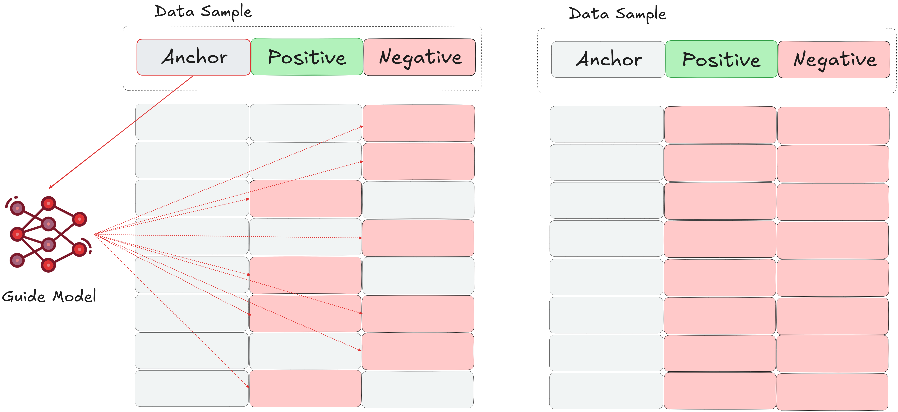
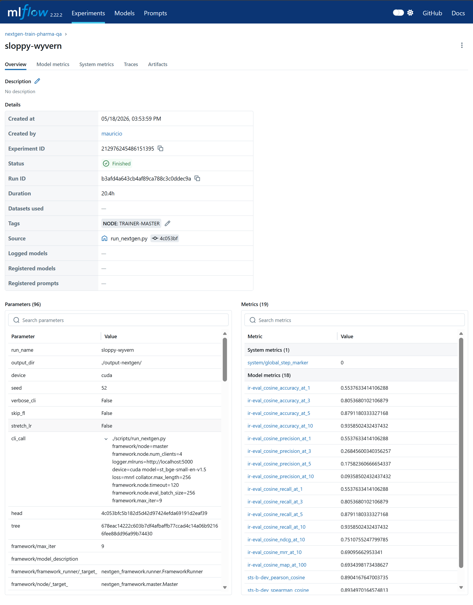

### Training

In this section we describe the context of the model training process, highlighting some of the key implementation focus points for the project.

#### Docker

As mentioned in previous sessions, we use Docker containers as optimized, isolated environments for running training on specific compute architectures. There are two considerations here: 1) optimizing the Dockerfile itself, and 2) optimizing how the Docker image is run. General Dockerfile optimization is out of scope of this report, however there are a couple of patterns worth highlighting:

##### Optimizing Dockerfiles
1. Using a multi-stage approach, where we first parse the project dependencies, and feed this dependency list to a second stage built on top of hardware-specialized base image (e.g. provided by the hardware manufacturer).
2. For the first stage above, making sure that our installed dependencies do not override optimized libraries of the base image of the second stage. For example, an image for Gaudi deployment could use a base image Habana Labs in the second stage:

    ```Dockerfile
    FROM vault.habana.ai/gaudi-docker/1.24.0/ubuntu22.04/habanalabs/pytorch-installer-2.10.0:latest
    ```
    This image already contains optimized libraries like Pytorch; if some other project dependency requires these libraries, it could potentially overwrite the optimized one with the generic variant, leading to worse performance in the best case and catastrophic incompatibilities in the worst case. Therefore, it is recommended to first transparently generate the list of dependencies, and filter out potential offenders manually:

    ```Dockerfile
    RUN uv export --frozen --no-dev --group training --group gaudi --no-hashes --no-emit-project --format requirements-txt > requirements.txt
    RUN grep -vE '^(torch|torchvision|torchaudio|vllm|nvidia|triton)' requirements.txt > requirements.final.txt
    ```

Installing these dependencies in the second stage should consider the `--no-deps` flag to avoid chasing indirect dependencies and installing only the previously exported ones:

```Dockerfile
RUN uv pip install ... --no-deps -r requirements.final.txt
```

Building these development Docker images currently only requires build secrets for `uv` authorization (username and password / PAT, for dependencies that require authorization) and for CA certificates (for general internet connectivity). See examples in the repository for more details.

##### Optimizing `docker run`

These are mostly low-level optimizations that are highly specific to the specific hardware setup and therefore might not generalize. These options include setting things like kernel and stability flags, hardware access and isolation flags, debugging flags, and manipulating environment settings via e.g. environment variables. Here is an example that explicitly sets different cache locations for different Gaudi HPUs in a single host, in order to avoid cache poisoning or locking when e.g. launching clients simultaneously on different HPUs. See `nextgen-train/scripts/` for more details:

```bash
docker run -it --rm --runtime=habana ... 
    -e HABANA_VISIBLE_DEVICES=$DEVICE_ID 
    -e PT_HPU_RECIPE_CACHE_CONFIG=/tmp/recipe_cache_$DEVICE_ID,False,1024
    ...
```

#### Models

As explained above, this pharmaceutical RAG use case involves two types of models: the downstream conversationalist LLM, and the embedding model, which is what we fine-tune in this project. The downstream model is a small [Qwen/Qwen2.5-7B-Instruct](https://huggingface.co/Qwen/Qwen2.5-7B-Instruct) and remains constant throughtout all experiments. For the embedding models, we consider 3 popular alternatives to represent different architectural eras and size-to-performance ratios:

|  | [all-MiniLM-L6-v2](sentence-transformers/all-MiniLM-L6-v2) | [all-mpnet-base-v2](sentence-transformers/all-mpnet-base-v2) | [bge-small-en-v1.5](BAAI/bge-small-en-v1.5) |
| :--- | :--- | :--- | :--- |
| **Architecture** | Distilled BERT | MPNet | BERT |
| **Parameters** | 22.7M | 109M | 33.4M |
| **Transformer Layers** | 6 | 12 | 12 |
| **Dimensions** | 384 | 768 | 384 |
| **Max Tokens** | 512 | 384 | 512 |
| **Mean [MTEB](https://mteb-leaderboard.hf.space/?benchmark_name=MTEB%28eng%2C+v2%29) [@enevoldsen2025mmtebmassivemultilingualtext] Score (Task)** | ~59.03 | N/A | ~64.3 |


`all-MiniLM-L6-v2` represents the traditional "fast and cheap" control model. With only 6 layers and ~22M parameters, it was historically the go-to choice for low-VRAM environments. In a federated learning context, its tiny parameter footprint makes it incredibly fast to transmit across the network between the master and client nodes.

`all-mpnet-base-v2` was for many years the industry standard for high-performance retrieval. However, it requires significantly more compute: it has 5x the parameters of MiniLM, a wider embedding dimension (768), and a restrictive max sequence length (384 tokens).

`BAAI/bge-small-en-v1.5` is a popular, modern SOTA model in its category (i.e. models < 100M parameters). It retains the same lightweight embedding dimension (384) as MiniLM and only increases the payload size slightly (to 33M parameters), making it efficient for federated network transmission and edge-compute memory constraints. Despite being 3x smaller than MPNet, its modern contrastive pre-training and 12-layer depth allow it to outperform the larger MPNet on many [MTEB](https://mteb-leaderboard.hf.space/?benchmark_name=MTEB%28eng%2C+v2%29) tasks. We explicitly select this model for our benchmarking because it represents the SOTA within the <100M parameter tier, offering the highest possible retrieval performance while maintaining a manageable payload size of under 100MB.

While frontier embedding models in the 7B–8B parameter class (such as Qwen or Llama-based embedders) achieve significantly higher absolute MTEB scores, they require moving GBs worth of weights per communication round, especially as we scale the number of clients. This renders them logistically unviable for rapid federated learning prototyping.


#### Losses

As we are finetuning embedding models with contrastive learning approaches, we require contrastive learning loss functions. In this report we focus on two different loss functions, [Multiple Negative Ranking Loss (MNRL)](https://sbert.net/docs/package_reference/sentence_transformer/losses.html#multiplenegativesrankingloss) and [Cached GIST Embed Loss](https://sbert.net/docs/package_reference/sentence_transformer/losses.html#cachedgistembedloss). 

MNRL (the Information Retrieval community's implementation of the widely known InfoNCE contrastive loss function) is the "bread and butter" of modern text embedding fine-tuning. Its main advantage is that it doesn't strictly require negatives: For each sample `(Anchor, Positive)` in a batch, this loss assign every other anchor's `Positive` as a negative. That is, for a batch size `k`, we get `k-1` negatives per anchor. The loss function itself is basically just a classification (Cross Entropy) loss that predicts each anchor's $a_i$ `Positive` $p_i$ against the rest of the positives and negatives in the batch:

$$L = -\frac{1}{n} \sum_{i=1}^{n} \log \frac{e^{\text{sim}(a_i, p_i) / \tau}}{\sum_{j=1}^{n} e^{\text{sim}(a_i, p_j) / \tau}}$$

The Cached GIST Embed Loss addresses two core issues with MNRL / InfoNCE. First, instead of matching every anchor to every other anchor’s positive / negative as a negative, it filters out the bad matches with the help of a "guide model". The second improvement builds on the observation that unlike in supervised learning, contrastive learning generally improves when the batch size is large, see below. Large batches can be broken down and processed as mini batches without changing the mathematical result, but at the cost of additional latency.   





It is important to note that this caching mechanism is unlike the effect of setting `gradient_accumulation_steps` > 1. Fundamentally, and unlike supervised learning, *the loss function itself is a function of the batch size*. Therefore, in contrastive learning:


::: {.prompt-box}
The batch size isn't (just) an efficiency metric. It's the definition of the task itself. Using large batches translates to navigating sharp, high-resolution loss landscapes, while using smaller batch sizes translates to navigating flat, low-resolution loss landscapes.
:::


The implications on federated learning are considerable: in FL with heterogenous compute (i.e. different VRAM capacities), averaging these models without weighting or scaling is mathematically equivalent to mixing high- and low-definition signals. See the section further below for additional explanations on how to understand the batch size in contrastive learning tasks.

##### Losses and Compute Architectures

The selection of loss function for this use case is not arbitrary, and is heavily tied into the architecture of the compute itself. As discussed above, for contrastive learning it is mostly preferable to maximize the batch size as much as possible. This of course has its limits, in that as the batch size is increased, so does the probability of including false negatives into the batch (samples which are actually `Positives` to the anchor, which are treated as negatives by e.g. a simple algorithm like MNRL). This adds noise to learning signal, and a good way to assess the tradeoff is by simply increasing the batch size until a retrieval metric like MRR (Mean Reciprocal Rank, see evaluation section below) starts to be affected.

Building large batch sizes can be achieved in different ways. The most straightforward one is to join the batches across all units in a DDP setup; this can be done by setting `gather_across_devices` parameter in the `TrainingArgs` input to the (HuggingFace) Trainer object. 

Otherwise, as described above, the `CachedGISTEmbedLoss` itself is a means of dealing with the memory bottleneck of MNRL and thus a way to benefit from larger batches by processing them as mini-batches. However, the Gaudi HPU architecture, which heavily relies on lazy evaluation on static, compiled graphs, poses difficulty for this loss function on at least two different fronts that we directly observed in this project:

- **Custom Autograd**. `CachedGISTEmbedLoss` (and similar implementations like `CachedMultipleNegativesRankingLoss`) relies heavily on gradient caching algorithms. These algorithms break the forward and backward passes into micro-batches using highly customized `torch.autograd.Function` implementations to manually manipulate and accumulate gradients. For Intel Gaudis, the SynapseAI graph compiler gets its massive speedups by tracing standard PyTorch operations and compiling them into highly optimized, static C++ HPU Graphs (`use_hpu_graphs_for_training=True`). When faced with a custom `backward()` pass that it cannot statically trace, it is forced to fall back to dynamic/eager execution, which to a large extent nullifies the benefit of hardware acceleration.

- **VRAM Fragmentation**. Gaudi's memory allocator is highly optimized for predictable, contiguous memory blocks. `CachedGISTEmbedLoss` intentionally manipulates memory allocation for mini batches, dropping negatives filtered out by the guide model and their intermediate activations (i.e. leading to dynamic tensor shapes), holding onto cached gradients, and stitching them together later. This constant allocation and deallocation of fragmented tensors prevents SynapseAI from efficiently caching memory workspaces, often leads to OOM errors, as memory quickly becomes saturated with stale, outdated graphs rather than actual data (graph cache exhaustion).

As an example for the impact on memory usage, running the training on a Gaudi2 (98GB VRAM) with `CachedGISTEmbedLoss` and a small model (<100MB size) topped out at a total batch size of only 2048 (with each sample in the batch composed of a `anchor`, `positive`, `negative` triplet, each truncated at 256 tokens). In comparison, using a simpler MNRL loss that does not introduce dynamic tensor shapes in the same way allowed us to raise the batch size to 8192.

As a general rule of thumb, in every experiment we maximize the batch size for each compute unit. For Gaudi HPUs, this meant using MNRL instead of `CachedGISTEmbedLoss`; for the smaller AMD and NVIDIA cards (each with only about half the memory as the Gaudis), where no static graphs are compiled, we used `CachedGISTEmbedLoss` to simulate as large a batch size as possible. For example, for the AMD accelerator, we were able to achieve a similarly large batch size of 8192 as the Gaudis in this way. See details in the section on compute below.


#### Optimizers

For all fine-tuning experiments, we utilized the Fused AdamW optimizer `adamw_torch_fused`. While AdamW is the de facto standard for training transformer-based architectures due to its decoupled weight decay (which significantly improves model generalization and prevents overfitting) the specific selection of the fused implementation was driven by hardware efficiency constraints.

Standard optimizer steps launch multiple sequential kernels to update gradients, momentums, and weights, creating a severe memory-bandwidth bottleneck. The fused implementation combines these element-wise operations into a single kernel execution. In the context of our heterogeneous compute framework (e.g. specifically for Intel Gaudi HPUs) this optimization theoretically reduces kernel launch overhead, minimizes VRAM read/write operations, and prevents costly CPU-device synchronizations. This approach complements the static graph compilation of the SynapseAI compiler, ensuring maximum throughput during the federated training rounds.

#### Logging

We use the [MLFlow Tracking API](https://mlflow.org/docs/latest/ml/tracking/tracking-api/) to log model metrics during experiments. Due to its MLFlow integration, the Gitlab instance can be used as an MLFlow tracking server, however for our experiments we run servers independently, as the UI is simply better and more flexible. Starting an MLFlow server is simple:

```bash
uv run mlflow server --backend-store-uri /mlruns --port 5000
```

Then, when launching a client or master node, we can simply point it to this endpoint:

```bash
source .env && ./scripts/run_amd_dev.sh amd-env:latest 0 python scripts/run_nextgen.py framework/node=client logger.mlruns="http://localhost:5000" ...
```

Our general logging strategy for federated learning is therefore as follows: Logging happens on the per-node level. All runs share the same global run name, which can be either be given by the user or auto-generated if no name is provided. To differentiate runs with the same name in the backend, we also attach a node-ID tag to each run to identify the responsible node in each case, see @fig-mlflow. For each experiment run, we log all metrics returned by the configured evaluators (see below), as well as all the metadata and hyperparameters required to reproduce the run from scratch.

{#fig-mlflow width=100%}


#### Compute

To practically evaluate the framework's ability to orchestrate federated learning across a diverse, decentralized hardware landscape, we utilized three distinct compute environments. These environments span different silicon architectures (Intel, AMD, NVIDIA), memory capacities, geographical locations, and access paradigms.

| Hardware / Accelerator | Memory | Units | Location | Access Method |
| :--- | :--- | :--- | :--- | :--- |
| **Intel Gaudi 2** | 98 GB | 2 | AI Sweden (Linköping) | Direct VM (Single Host), HPUs used independently |
| **AMD 7900 XT** | 46 GB | 1 | AI Sweden (Gothenburg) | Direct VM |
| **NVIDIA A100** | 40 GB | 1 | AI Sweden (Gothenburg) | AiQU Scheduler (Part of 4x Host) |

The intent here is to mirror the reality of modern enterprise deployments on a small scale. It successfully demonstrates the framework's capability to seamlessly integrate high-performance clustered environments managed by enterprise schedulers (the NVIDIA A100 via AiQU) with standalone, direct-access virtual machines utilizing competing accelerator architectures (the Intel HPUs and AMD GPU).

In particular, the Gaudi HPU performance is on another league in comparison to the AMD or NVIDIA: by leveraging more memory and the static graph compiler, we estimate a speedup factor of about 5x in comparison to the (optimized) AMD or NVIDIA setups, measured in terms of the time required to complete 1 training epoch on the same data.

#### Trainers

Our implemenation distinguishes between two different types of trainers: 1) the underlying, third party model trainer that abstracts low level processes such as backpropagating gradients to the model, and 2) the NextGenFramework trainer which orchestrates the former in a federated learning loop. In the following we provide additional relevant details for both.

##### Model Trainer

A key difficulty we faced in this project was finding and adapting the right software stack for the training job. The inherent difficulty is the limited software support for certain hardware, which propagated low-level dependencies to the highest abstraction layers in a way that cannot easily be solved at scale with just Docker containerization strategies. An example: training on Intel Gaudi 2 implies a dependency on the HuggingFace ecosystem ([optimum.habana.GaudiTrainer](https://huggingface.co/docs/optimum-habana/package_reference/trainer)), however we require the [SentenceTransformers](https://sbert.net/) library for e.g. pretrained models or loss implementations. While it is theoretically possible to write completely different trainers depending on the compute hardware itself, this is undesirable from a robustness and traceability perspective.

To solve this, we subclassed `GaudiTrainer` to produce `STGaudiTrainer`, an implementation that makes it compatible with the SentenceTransformers library. The key difference is here is rooted in a historical philosophical difference between the HuggingFace and SentenceTransformers libraries: the former assumes that the model itself owns the loss and its calculation, while the latter separates the loss from the model itself. Our implementation `STGaudiTrainer` overrides key methods of `GaudiTrainer` to allow injection of the loss object and evaluator object, which is run as a training callback. By bridging this gap we ensure that the implementation is suitable for CPU, GPU, HPU and multi-GPU/HPU training. Some other necessary compatibility patches include:

  - Syntax compatibility. SentenceTransformer models do not accept unpacked arguments when calling the model as in `model(**inputs)`, only a single dictionary argument. This is patched by overriding `prediction_step`, and using a two step process: 1) producing features from the inputs, and 2) calling the loss function explicitly.

  - Evaluation Context and Hardware Bridging. NLP libraries like SentenceTransformers often make implicit assumptions about hardware (i.e. ability to have dynamic tensor shapes and `float32` memory) that must be overriden when migrating to heterogeneous, compiled enterprise compute like Intel Gaudi 2. Specifically, we manually override the `model.encode` method to enforce strict behaviors at evaluation time: 1) static tensor shapes (via `padding=max_length`) to prevent hardware graph recompilation crashes (graph exhaustion) on XLA/HPU devices, and 2) a final cast to `float32` to prevent conversion crashes during DDP runs operating in `bfloat16` mixed-precision.

Here are some other generic patterns / settings we used to optimized the training process:

  - For Gaudi HPUs, make sure to set `use_hpu_graphs_for_training: True` for optimum performance. This enables lazy (rather than eager) execution based on static graph profiles built by the SynapseAI compiler. Requires additional tuning / overriding of specific SentenceTransformers model functions as explained above.

  - Pick the right data format: `bf16` vs. `tf32`. While (at the time of writing) unsupported for Gaudi HPUs, the integrated `bf16` support for NVIDIA Ampere GPUs and our AMD accelerator leads to ~3x speedup at minimal precision loss.
   
  - There are key top-level settings that enable large batch sizes without OOM errors:
    - Explicitly setting collator to a reasonably small max length, for example 256. Because the computational complexity of standard self-attention scales quadratically with sequence length, aggressively truncating inputs ensures VRAM usage and training time remain tightly bounded (even with memory-efficient SDPA implementations, the linear growth of intermediate activations consumes a lot of space).

    - Using `gradient_checkpointing=True`. This technique drastically reduces memory consumption by discarding intermediate activations during the forward pass and recomputing them on the fly during the backward pass, effectively trading a slight compute overhead for massive VRAM savings.

Working with a [Distributed Data Parallel](https://docs.pytorch.org/tutorials/intermediate/ddp_tutorial.html) model remains of course highly relevant, for example when joining several physical accelerators into a single node of the training framework. Here are some of the optimized settings and adjustments that were required for integration with our trainer implementation:

  - Setting `ddp_find_unused_parameters: True` forces an additional graph traversal every step; this step is only only necessary if the underlying model has specific layers that are skipped during the forward pass. Doing this on Gaudi can sometimes interfere with graph compilation optimization, and therefore it is highly recommended to set to `False` in this case.

  - Set `ddp_broadcast_buffers: False` with care. Batch Normalization layers for e.g. traditional computer vision / CNN models relies on these bufferes to sync running mean and variance stats across GPUs, so if training such models this would need to be set to `True` (this doesn't apply for Transformers with more modern `LayerNorm` layers, as these compute statistics per-sample and do not track running batch statistics). Setting this to `True` when using both DDP and `gradient_checkpointing=True` is an issue though - we set it to `False` to prevent DDP from doing in-place network broadcasts of static model buffers (like BERT's position_ids). Otherwise, the in-place overwrite artificially bumps the tensor's version counter, causing Gradient Checkpointing to instantly crash during the backward pass with a *"modified by an inplace operation"* RuntimeError.

  - Dealing with stateful losses in DDP requires attention. Stateful losses (GIST, contrastive losses, etc.) from SentenceTransformers have a copy of the model inside them, which is *not* necessarily the same reference as the Trainer's model reference. This causes issues with DDP because the Trainer wraps the model in DDP after we pass it in. Solution: for the loss computation in `compute_loss`, "swap" the models to make sure that we use the potentially DDP-wrapped one.

  - `DDP Static Graph Enforcement:`. Combining gradient checkpointing with advanced cross-device loss functions (like MNRL with `gather_across_devices=True`) inherently destabilizes PyTorch’s DDP synchronization hooks during the backward pass. To prevent synchronization deadlocks, we injected a custom callback that explicitly enforces `_set_static_graph()` on the DDP wrapper at the start of every step, locking the gradient synchronization topology and ensuring stable execution across all compute nodes.
  
  - Explicitly monitor for silent, fatal bugs in DDP during `training_step` (these checks actually helped us catch these bugs at work):

    1. The "clone" (data duplication) bug: The `DataLoader` should have a `DistributedSampler` that prevents the exact same data being loaded on all units. To check this, we can look at the tokens across ranks: we expect to see *different* tokens for different ranks.

    2. The DDP bypass bug: messing with the DDP wrappings that the Trainer has access to can inadvertently destroy the "networking" hooks that force the compute units to pause and average gradients across the network. In this case, each unit will appear busy and train normally, but they will each train *their own model that never gets averaged* back with the rest. To check this, we can examine the gradients across ranks: we expect to see the exact same gradients across ranks (after they are gathered and averaged).


##### NextGenFramework Trainer

The design of the top-level trainer which implements the federated training abstractions of NextGenFramework is also unfortunately not completely decoupled of underlying hardware considerations. This trainer manages and orchestrates objects that we put into one of two categories as follows:

  1. The static layer: These components are expensive to load, completely stateless regarding the training loop, and—most importantly, they have no dependencies on components that are part of the computation graph. Examples here include the tokenizer, the collator, and the data pipelines.

  2. The ephemeral layer: These components form the active computational graph. The model itself is the first obvious element. Others may hold VRAM, track step counts, etc. If a component depends on another component that lives in this layer, then by definition it must also belong to this layer. Examples include the loss function, callback functions, the evaluator object, guide model (if applicable).

FL training loops pose a challenge because they essentially run the same training loop over a number of learning rounds. This can, however, result in memory leaks, orphaned processes, and state corruption across FL rounds. For this reason, the ephemeral layer of components must be systematically destroyed and restored across FL training rounds. While not *functionally* necessary when using NVIDIA / AMD (eager mode), the consequences are harsher for Gaudi / in lazy execution mode: Gaudi builds wrappers when e.g. `trainer.train()` is run, and doing this twice in a row fails at runtime (it attempts to wrap the wrapper). Therefore, we rely on the notion of building and tearing down the computation graph on demand.

  
#### Federated Learning

The mechanics of the federated learning process are all managed by the NextGenFramework dependency. All of our experiments implement a simple FedAvg algorithm, which computes the unweighted average across all client models between federation rounds. We implement one modifier here, namely the ability to stretch the learning rate across federation rounds, so there is only one warmup period, rather than one warmup period per training round. Traditionally, optimizer state and learning rate schedules are reset when starting a new training round. In terms of the learning rate, the effect of this default mode is similar to using [Cosine Annealing with Warm Restarts](https://docs.pytorch.org/docs/2.12/generated/torch.optim.lr_scheduler.CosineAnnealingWarmRestarts.html), as the learning rate quickly warms back up to the target at the start of every round. While potentially a useful approach for some learning problems, this variant doesn't let the learning take advantage of the long tail of the learning schedule useful for small scale fine tuning. Our results indicate no performance loss when using an extended schedule, so we keep this as the default approach unless otherwise stated.

The distribution of data between different clients of course plays an important role in terms of how the federation between clients must be set up. Because the focus of the project is the training framework for heterogeneous compute rather than the federated learning itself, we explicitly do *not* focus on non-IID scenarios that would require more involved federated learning strategies, and instead simply rely on stochastic data sharding between clients. More specifically, each client in the federation downloads / caches the entire dataset, but only loads a specific data shard. For example, our data class specifies:

```python
self._train_dataset = (
  split_dataset["train"].shuffle(seed=seed).shard(num_shards=num_shards, index=shard_idx, contiguous=True)
)
```

The total number of shards and shard index are just another set of hyperparamters that the user must pass to the experiment run:

```bash
source .env && ./scripts/run_gaudi_dev.sh gaudi-env:latest 0 python scripts/run_nextgen.py framework/node=client data.num_shards=2 data.shard_idx=0 ... 
```


#### Experiment Runs

We use a single training script powered by [Hydra](https://hydra.cc/) to provide flexibility for different run customizations. Hydra's hierarchical configuration pattern allows the user to specify simple top-level settings as well as individual configurations for more complex parts of the training pipeline such as the model, the data, the loss, the trainer, etc. By importing `NextGenFramework` as a dependency, users can override the federated learning configuration settings in the `framework` config group (see examples below). All configs, sub-configs and their defaults can be found in `nextgen_train/configs`.

Please see the [NextGenFramework documentation](https://pages.mgmt.ai.se/nextgeninfra/nextgen_framework/latest/usage/) for an explanation of the individual integrations steps. In short, there are 2 high level ways to start a training run:

- Direct accelerator access: using a specialized Docker environment. We provide Dockerfiles to build these environments for AMD and Gaudi in `/docker`. The actual entry point to use those environments can be found in `/scripts`, see examples below.

- Using a scheduler. This happens via the CI/CD pipeline in this repo, which builds a standalone Docker image containing all the source code, and instructs the scheduler to run a container with this image using a job submission REST request. This logic is abstracted away in the `NextGenFramework` dependency, which we leverage in our CI/CD pipeline by importing and overriding the job submission job. See `.gitlab-ci.yml`.

In both cases, we pass all configuration options of the run as command line arguments that are parsed by Hydra at runtime. This results in an often lengthy, but self-contained command line input string that deterministically specifies the run. See `nextgen_train/configs` for all possible configuration and parameter override options.

##### Examples

The following calls start a master node (does no training, just aggregates model weights) together with 2 individual clients (which do the actual training), each running on a separate Gaudi HPU, on 2 distinct shards of the same total input data, for a total of 9 federated learning rounds. The clients connect to the training run via the `run_name` parameter.

  Server:

  ```bash
  source .env && uv run python ./scripts/run_nextgen.py framework/node=master framework.node.num_clients=2 logger.mlruns="http://localhost:5000" device=cuda model=st_all-minilm-l6-v2 loss=mnrl collator.max_length=256 framework.node.timeout=120 framework.node.eval_batch_size=256 framework.max_iter=9 run_name=my_test_run
  ```

  Client 1:

  ```bash
  source .env && ./scripts/run_gaudi_dev.sh gaudi-env:latest 0 python scripts/run_nextgen.py framework/node=client framework.node.client_id=1 framework.node.download_dir="./output-nextgen/client_1" framework.node.timeout=120 framework.max_iter=9 logger.mlruns="http://localhost:5001" device=hpu trainer=st_gaudi_trainer_fed model=st_all-minilm-l6-v2 collator.max_length=256 loss=mnrl trainer.args.per_device_train_batch_size=8192 trainer.args.per_device_eval_batch_size=256 trainer.args.num_train_epochs=1 trainer.args.learning_rate=1.7e-3 stretch_lr=True data.num_shards=2 data.shard_idx=0 trainer.args.eval_steps=50 run_name=my_test_run
  ```

  Client 2:

  ```bash
  source .env && ./scripts/run_gaudi_dev.sh gaudi-env:latest 1 python scripts/run_nextgen.py framework/node=client framework.node.client_id=2 framework.node.download_dir="./output-nextgen/client_2" framework.node.timeout=120 framework.max_iter=9 logger.mlruns="http://localhost:5001" device=hpu trainer=st_gaudi_trainer_fed model=st_all-minilm-l6-v2 collator.max_length=256 loss=mnrl trainer.args.per_device_train_batch_size=8192 trainer.args.per_device_eval_batch_size=256 trainer.args.num_train_epochs=1 trainer.args.learning_rate=1.7e-3 stretch_lr=True data.num_shards=2 data.shard_idx=1 trainer.args.eval_steps=50 run_name=my_test_run
  ```

It is also possible to skip the FL training setup altogether to just run the training directly. In this case we can simply start a client and specify `skip_fl=True`, which means that the client bypasses the entire FL synchronization mechanism and simply trains the model in a centralized setting. Corresponding example:

  ```bash
  source .env && ./scripts/run_gaudi_dev.sh gaudi-env:latest 0 python scripts/run_nextgen.py framework/node=client framework.node.client_id=1 logger.mlruns="http://localhost:5001" device=hpu trainer=st_gaudi_trainer model=st_all-minilm-l6-v2 collator.max_length=256 loss=mnrl trainer.args.per_device_train_batch_size=8192 trainer.args.per_device_eval_batch_size=256 trainer.args.num_train_epochs=1 trainer.args.learning_rate=1.7e-3 stretch_lr=True data.num_shards=1 data.shard_idx=0 trainer.args.eval_steps=10 skip_fl=True
  ```


