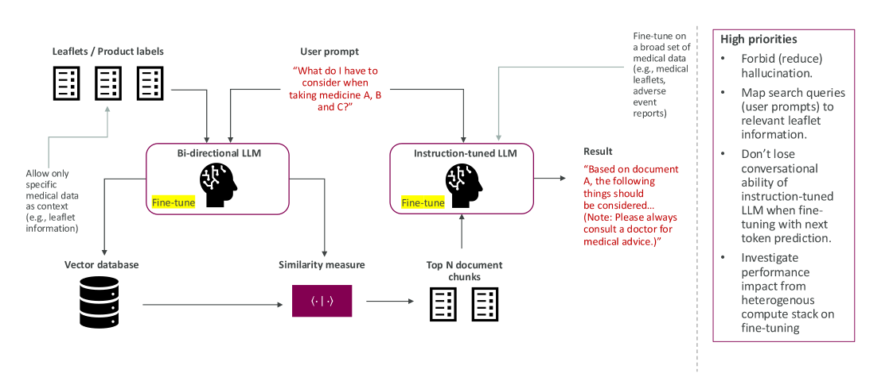

### About the Use Case

AstraZeneca is a large global biopharmaceutical company engaged in the discovery, development, and commercialization of prescription medicines, operating in over 100 countries worldwide. AI engineers within the engineering team for the [Centre of Artificial Intelligence](https://www.astrazeneca.com/r-d/data-science-and-ai.html) (part of Data Science & AI in Biopharmaceutical R&D) collaborated on this project, including the definition of this use case, to further the goal of bridging the gap between the latest AI techniques and their applications within AstraZeneca to accelerate drug discovery, optimize clinical trials and improve patient outcomes across all therapy areas.

By prioritizing the development of in-house specialist models, AstraZeneca maintains absolute control over both its proprietary data and the resulting models. The specialization and application of LLMs in clinical settings present unique operational and ethical challenges. Most notably, in contexts where patient health, scientific accuracy, and regulatory compliance are paramount, model hallucinations are strictly forbidden. For this reason, the present use case was consciously scoped around improving performance of retrieval models in the context of Retrieval-Augmented Generation (RAG). In contrast to e.g. unconstrained generation, this methodology ensures traceability by grounding the model's outputs in verifiable citations from trusted medical literature. Furthermore, the highly sensitive nature of pharmaceutical and patient data necessitates stringent privacy measures, making federated training a highly relevant approach. Interest in this project was driven by a desire to understand the performance penalty of learning in a decentralized way, in addition to the penalty introduced by incorporating heterogeneous compute into the mix. 

Beyond the immediate technical requirements of clinical deployment, this project served as a crucial opportunity for exploration and experimentation. By participating in this collaborative framework, the team aimed to expand its expertise in the latest AI techniques and refine its methodologies for rigorously evaluating LLMs within highly restricted domains.

### Problem Statement

Patients using multiple medicines must currently cross-reference various lengthy medical leaflets to identify potential drug-drug interactions and side effects. This is a highly complex task that requires navigating obscure medical vocabularies — for example, mapping brand names to their underlying active ingredients. Here is an example query a patient might have:

::: {.prompt-box}

I currently take medicines A, B, and C. I am planning to start medicine D. Are there any specific interactions or side effects I should worry about?”

:::

### Implementation Plan

{#fig-az width=100%}

A typical RAG system is composed of two distinct models: an embedding model, which projects offline documents and live user queries into a shared latent space to retrieve relevant information via similarity search, and a conversational LLM (the generator), which receives the retrieved text context to formulate a grounded, natural-language response. Rather than focusing on fine-tuning the downstream generative model—which risks catastrophic forgetting and damaging its general reasoning or conversational abilities without careful instruction re-tuning—this project focuses on the highly impactful but underexplored area of fine-tuning the embedding model itself. By training the embedding model specifically on pharmaceutical data and clinical nuances, the goal is to achieve better spatial separation and clustering in the latent space. This fundamentally improves the quality and relevance of the retrieved data, allowing the downstream generator to cite and refer to highly accurate passages in medical leaflets. 

The main novelty and challenge of this project was to perform this embedding model fine-tuning using a decentralized, federated approach across heterogeneous compute environments, and to quantify the performance penalty of this approach compared to a traditional centralized training baseline.

To accomplish this, a key implementation hurdle was adapting the raw pharmaceutical leaflets into a format suitable for contrastive learning, the learning paradigm by which embedding models are trained. Fine-tuning a retrieval model requires positive semantic pairs, and (whether explicitly or implicitly) some notion of semantic negatives. A considerable portion of the overall effort was dedicated to building a data pipeline that generates a sufficiently diverse, leaflet-based Question-Answering (QA) dataset, encapsulating both simple and ideally also complex queries spanning multiple medicines. See below for more details on the available data sources and this pre-processing pipeline.

Finally, a robust evaluation concept is paramount to the implementation plan. We quantitatively evaluate the success of this project on two fronts: 1) the retrieval performance, i.e. evaluating the mathematical improvement of the embedding model itself on ranking metrics, and 2) the impact on system performance, i.e. evaluating the downstream impact of the fine-tuned embeddings on the overall RAG system's answer generation. See below for more details on this evaluation process.